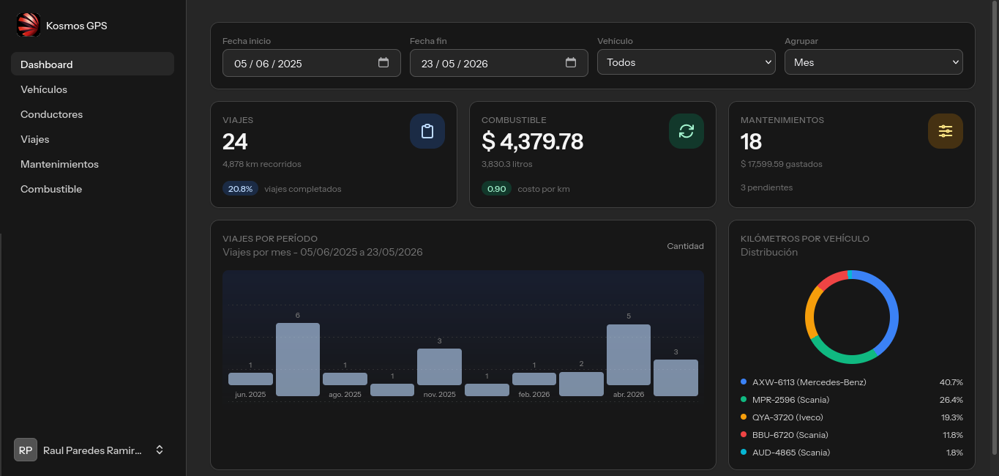
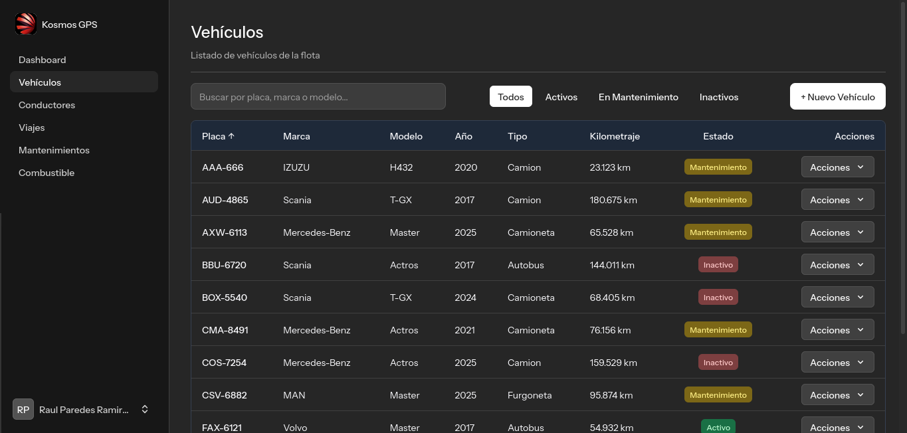
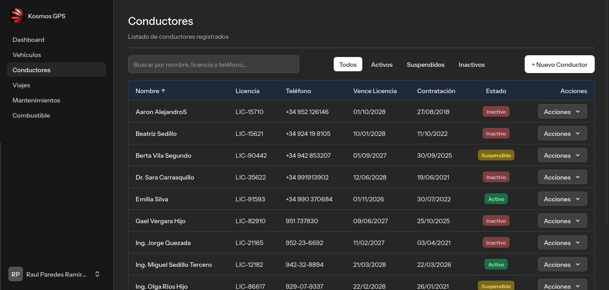
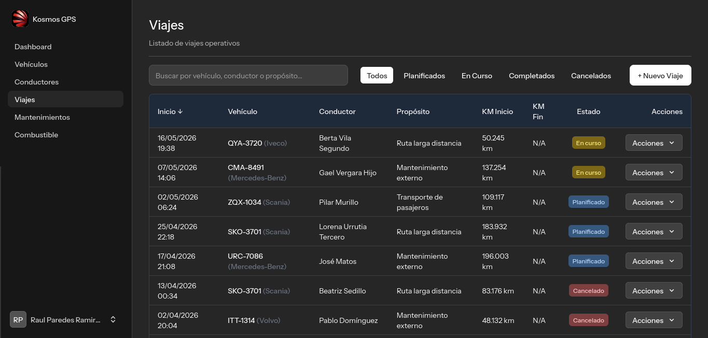
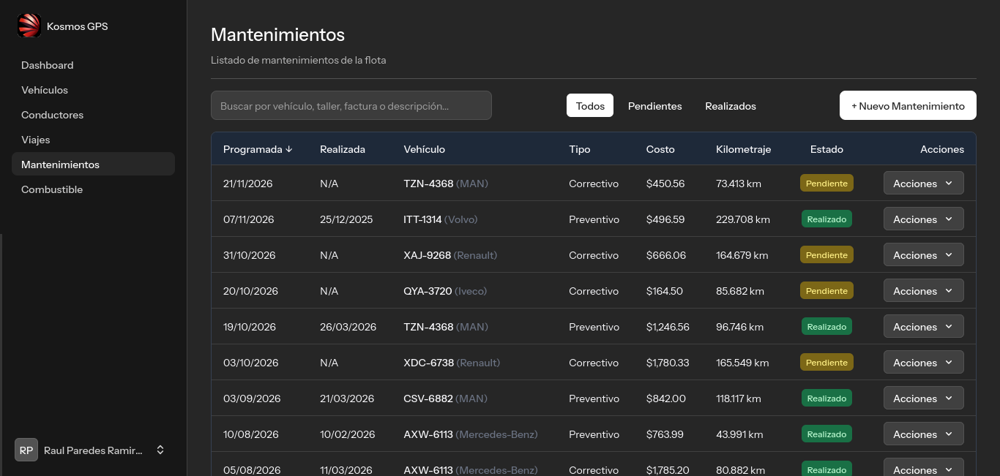
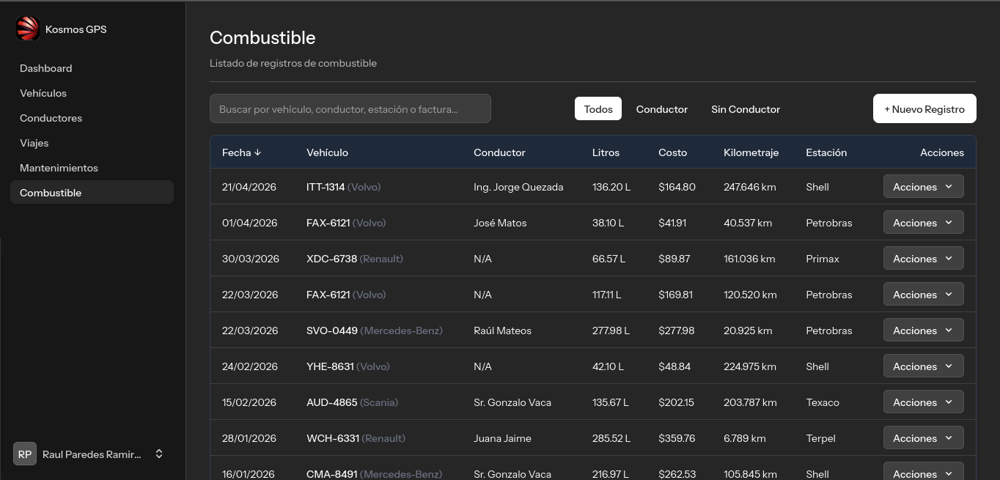
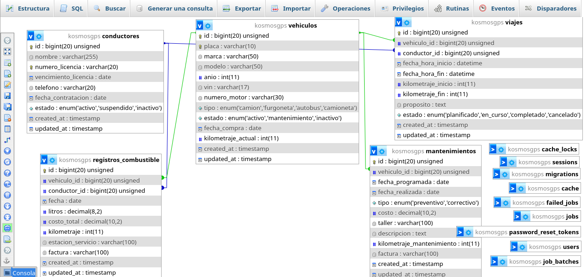

# Kosmos GPS

Sistema de gestión de flotillas (fleet management) con control de vehículos, conductores, viajes, mantenimiento y consumo de combustible desde un solo panel.

Desarrollado con **Laravel 13.x**, **Livewire 4**, **Flux UI 2** y **Tailwind CSS 4**.



---

## Stack tecnológico

| Capa | Tecnología |
|---|---|
| Backend | PHP 8.4 / Laravel 13.x |
| Frontend | Livewire 4 + Flux UI 2 + Tailwind CSS 4 |
| Assets | Vite 8 (compilados, incluidos en el repositorio) |
| Base de datos | SQLite (por defecto) — compatible MySQL, MariaDB, PostgreSQL, SQL Server |
| Colas / Caché | Database (por defecto) — compatible Redis |
| Autenticación | Laravel Fortify (login, registro, verificación email, 2FA, reseteo password) |
| Testing | Pest PHP 4 |

---

## Módulos del sistema

### Dashboard (`/dashboard`)

Panel analítico con visión general de la flotilla:

- Métricas clave: total de viajes y kilometraje, costo y litros de combustible, cantidad y costo de mantenimientos
- Gráfico de barras: viajes agrupados por día, semana o mes
- Gráfico donut: distribución de kilometraje por vehículo
- Filtros: rango de fechas, vehículo específico, agrupación temporal
- Indicadores: porcentaje de viajes completados, costo por kilómetro, mantenimientos pendientes

### Vehículos (`/vehiculos`)



CRUD completo para la gestión de unidades:

- Campos: placa (única), marca, modelo, año, VIN, número de motor, tipo (camión, furgoneta, autobús, camioneta), estado (activo, mantenimiento, inactivo), fecha de compra, kilometraje actual
- Búsqueda por placa, marca o modelo
- Filtro por estado
- Regla de negocio: no se puede eliminar un vehículo si tiene viajes asociados
- Exportación a PDF

### Conductores (`/conductores`)



CRUD completo para la gestión de conductores:

- Campos: nombre, número de licencia (único), vencimiento de licencia, teléfono, fecha de contratación, estado (activo, suspendido, inactivo)
- Búsqueda por nombre, licencia o teléfono
- Filtro por estado
- Regla de negocio: no se puede eliminar un conductor si tiene viajes o registros de combustible asociados

### Viajes (`/viajes`)



CRUD completo para la gestión de viajes:

- Campos: vehículo asignado, conductor asignado, fecha/hora inicio y fin, kilometraje inicio y fin, propósito, estado (planificado, en curso, completado, cancelado)
- Búsqueda por propósito, vehículo o conductor
- Filtro por estado
- Regla de negocio: al completar un viaje, si el kilometraje final supera el kilometraje actual del vehículo, se actualiza automáticamente el odómetro

### Mantenimientos (`/mantenimientos`)



CRUD completo para la gestión de mantenimientos:

- Campos: vehículo, fecha programada, fecha realizada, tipo (preventivo, correctivo), costo, taller, descripción, kilometraje, factura
- Búsqueda por taller, descripción, factura o vehículo
- Filtro por estado (pendientes / realizados)
- Regla de negocio: si el kilometraje del mantenimiento supera el kilometraje actual del vehículo, se actualiza automáticamente
- Exportación a PDF

### Combustible (`/combustible`)



CRUD completo para el registro de carga de combustible:

- Campos: vehículo, conductor (opcional), fecha, litros, costo total, kilometraje, estación de servicio, factura
- Búsqueda por estación, factura, vehículo o conductor
- Filtro por asignación de conductor (con conductor / sin conductor)
- Regla de negocio: si el kilometraje registrado supera el kilometraje actual del vehículo, se actualiza automáticamente
- Exportación a PDF

### Configuración (`/settings/*`)

- Perfil: actualizar nombre, email y reenviar verificación
- Seguridad: cambiar contraseña con confirmación
- Apariencia: selector de tema (claro, oscuro, sistema)

### Diagrama de base de datos



---

## Requisitos previos

- Docker Engine 24+
- Docker Compose v2
- Git

---

## Inicio rápido

### 1. Clonar el repositorio

```bash
git clone <url-del-repositorio> kosmos-gps
cd kosmos-gps
```

### 2. Construir la imagen Docker

```bash
docker compose build
```

### 3. Iniciar los contenedores

```bash
docker compose up -d
```

Esto levanta tres servicios:

| Servicio | Puerto | Descripción |
|---|---|---|
| `app` | — | PHP 8.4 FPM con la aplicación |
| `nginx` | `18080` → `80` | Servidor web |
| `mailhog` | `11025` (SMTP) / `18025` (UI) | Captura de correos en desarrollo |

### 4. Ejecutar migraciones y seeders

```bash
docker compose exec app php artisan migrate --force --seed
```

La base de datos SQLite se crea automáticamente dentro del volumen persistente `kosmos-storage`. Los seeders cargan datos de demostración (vehículos, conductores, viajes, mantenimientos, registros de combustible).

### 5. Abrir la aplicación

[http://localhost:18080](http://localhost:18080)

Registrar un nuevo usuario en `/register` para comenzar a usar el sistema.

### 6. Visualizar correos electrónicos (MailHog)

La UI de MailHog está disponible en [http://localhost:18025](http://localhost:18025). Allí aparecerán todos los correos enviados por la aplicación (verificación de email, reseteo de contraseña, etc.).

---

## Uso diario

### Iniciar / Detener servicios

```bash
docker compose start          # Iniciar servicios existentes
docker compose stop           # Detener servicios (sin eliminar)
docker compose up -d          # Iniciar o crear servicios
docker compose down           # Detener y eliminar contenedores
```

### Ejecutar comandos dentro del contenedor

```bash
# Shell interactivo
docker compose exec app bash

# Comandos Artisan
docker compose exec app php artisan migrate
docker compose exec app php artisan make:migration crear_tabla_ejemplo
docker compose exec app php artisan tinker

# Tests (Pest)
docker compose exec app php artisan test

# Limpiar caché
docker compose exec app php artisan optimize:clear
```

### Logs

```bash
docker compose logs -f app      # Logs de la aplicación
docker compose logs -f nginx    # Logs del servidor web
docker compose logs -f          # Logs de todos los servicios
```

---

## Puertos

| Puerto host | Puerto contenedor | Servicio |
|---|---|---|
| `18080` (configurable) | `80` | Nginx (aplicación web) |
| `11025` (configurable) | `1025` | MailHog SMTP |
| `18025` (configurable) | `8025` | MailHog UI web |

Para cambiar los puertos host:

```bash
APP_PORT=9090 MAILHOG_UI_PORT=9091 docker compose up -d
```

---

## Variables de entorno

### Docker Compose

| Variable | Default | Descripción |
|---|---|---|
| `APP_ENV` | `local` | Entorno de la aplicación |
| `APP_DEBUG` | `true` | Modo debug |
| `APP_PORT` | `18080` | Puerto para la interfaz web |
| `MAILHOG_SMTP_PORT` | `11025` | Puerto SMTP de MailHog |
| `MAILHOG_UI_PORT` | `18025` | Puerto UI web de MailHog |

### Laravel (`.env`)

| Variable | Default | Descripción |
|---|---|---|
| `APP_NAME` | `Kosmos GPS` | Nombre de la aplicación |
| `APP_URL` | `http://localhost:18080` | URL base |
| `DB_CONNECTION` | `sqlite` | Motor de base de datos |
| `SESSION_DRIVER` | `database` | Driver de sesión |
| `CACHE_STORE` | `database` | Almacén de caché |
| `QUEUE_CONNECTION` | `database` | Conexión de colas |
| `MAIL_MAILER` | `smtp` (vía MailHog) | Driver de correo en desarrollo |

> Para cambiar a MySQL, agregar un servicio `mysql` en `docker-compose.yml` y configurar las variables `DB_HOST`, `DB_PORT`, `DB_DATABASE`, `DB_USERNAME` y `DB_PASSWORD` en `.env`.

---

## Estructura del proyecto

```
├── app/
│   ├── Actions/
│   │   └── Fortify/             # Acciones de autenticación (CreateNewUser, ResetUserPassword)
│   ├── Concerns/                # Traits de validación (PasswordValidationRules)
│   ├── Livewire/                # Lógica de negocio (componentes full-page)
│   │   ├── Dashboard.php        # Panel analítico
│   │   ├── Vehiculos.php        # Gestión de vehículos
│   │   ├── Conductores.php      # Gestión de conductores
│   │   ├── Viajes.php           # Gestión de viajes
│   │   ├── Mantenimientos.php   # Gestión de mantenimientos
│   │   ├── Combustible.php      # Registro de combustible
│   │   └── Settings/            # Perfil, seguridad, apariencia
│   ├── Models/                  # Modelos Eloquent
│   │   ├── Vehiculo.php
│   │   ├── Conductor.php
│   │   ├── Viaje.php
│   │   ├── Mantenimiento.php
│   │   ├── RegistroCombustible.php
│   │   └── User.php
│   └── Providers/               # AppServiceProvider, FortifyServiceProvider
├── bootstrap/
│   └── providers/               # Proveedores registrados
├── config/                      # Configuración de Laravel
├── database/
│   ├── migrations/              # Migraciones de base de datos
│   └── seeders/                 # Seeders con datos de demostración
├── docker/
│   ├── php/
│   │   ├── Dockerfile           # Imagen PHP multi-etapa
│   │   └── entrypoint.sh        # Script de arranque (permisos, .env, APP_KEY)
│   └── nginx/
│       └── default.conf         # Configuración de Nginx
├── img-github/                  # Capturas de pantalla para README
├── lang/
│   └── es/                      # Traducciones al español
├── public/
│   ├── build/                   # Assets compilados (CSS/JS)
│   └── storage/                 # Enlace simbólico a storage/app/public
├── resources/
│   └── views/                   # Vistas Blade + Livewire
│       ├── layouts/             # Layouts (app, auth, sidebar)
│       ├── livewire/            # Componentes Livewire
│       ├── components/          # Componentes Blade reutilizables
│       └── flux/                # Componentes Flux UI personalizados
├── routes/
│   ├── web.php                  # Rutas principales (dashboard, módulos CRUD)
│   ├── settings.php             # Rutas de configuración
│   └── console.php              # Comandos Artisan
├── storage/
│   └── app/public/img/          # Imágenes subidas (logo, fotos de perfil)
├── .dockerignore
├── docker-compose.yml
└── bin/
    └── setup.sh                 # Script de configuración inicial
```

---

## Producción

### Ajustes recomendados

Antes de desplegar a producción:

1. **Variables de entorno**: configurar `APP_ENV=production`, `APP_DEBUG=false`
2. **Optimización**: ejecutar dentro del contenedor:
   ```bash
   docker compose exec app php artisan optimize
   ```
3. **Base de datos**: migrar a MySQL o PostgreSQL para mayor robustez
4. **SSL**: agregar un reverse proxy con Traefik, Caddy o Nginx Proxy Manager
5. **Backups**: programar respaldos del volumen `kosmos-storage` (contiene la base de datos SQLite y archivos subidos)
6. **Colas**: si se usa Redis, agregar el servicio en `docker-compose.yml` y cambiar `QUEUE_CONNECTION=redis`

### Construir para producción

```bash
APP_ENV=production docker compose build
docker compose up -d
docker compose exec app php artisan migrate --force --seed
docker compose exec app php artisan optimize
```

---

## Solución de problemas

### La aplicación se ve sin estilos

Asegúrate de que `public/build/` existe (debe venir incluido en el repositorio). Si no:

```bash
# Reconstruir assets (requiere Node.js en el host)
npm install && npm run build
```

### Error de permisos en storage

Si la aplicación reporta errores de escritura en la base de datos o archivos:

```bash
docker compose exec app chown -R www-data:www-data /var/www/storage /var/www/bootstrap/cache
```

> El entrypoint lo ejecuta automáticamente al arrancar el contenedor, pero si el volumen persiste con permisos incorrectos, este comando los corrige.

### Las imágenes no se muestran (logo, fotos)

El enlace simbólico `public/storage` debe apuntar a `storage/app/public`:

```bash
docker compose exec app php artisan storage:link
```

### Reconstruir desde cero

```bash
docker compose down -v           # Elimina volúmenes (incluye BD)
docker compose build --no-cache  # Reconstruye sin caché
docker compose up -d
docker compose exec app php artisan migrate --force --seed
```

### Resetear base de datos

```bash
docker compose exec app php artisan migrate:fresh --seed
```

---

## Licencia

MIT
